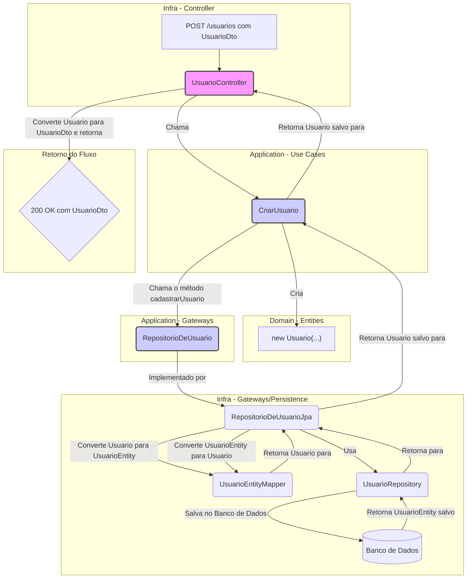

# CodeChella

App de simulação de um site para venda de ingressos de eventos diversos

## 🔨 Objetivos do projeto

- Conhecer os diferentes tipos de arquitetura de software;
- Aprender os princípios da Clean Architecture;
- Implementar um projeto com separação de responsabilidades e isolamento do domínio;
- Entender sobre entidades, objetos de valor, casos de uso, repositórios e controladores;
- Analisar os prós e contras de arquiteturas que utilizam muitas camadas de abstração.

# alura-clean-architecture

